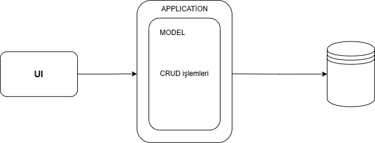
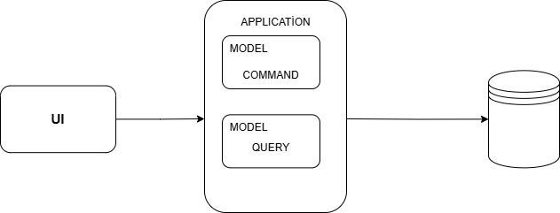

# CQRS
Geleneksel CRUD (Create, Read, Update, Delete) modelinde aynı veri modeli hem yazma hem de okuma işlemleri için kullanılırken, CQRS bu iki işlemi birbirinden ayırarak her birine farklı modeller tahsis eder.

CQRS (Command Query Responsibility Segregation), komut (command) ve sorgu (query) işlemlerini birbirinden ayıran bir yazılım mimari desenidir.

**Query Model (Sorgu Modeli)**

Sadece okuma işlemlerini (read) gerçekleştirir.

 Geriye sadece belirtilen modeli döner ve veri üzerinde  bir değişiklik yapmaz. GET ile isimlendirilir.

**Commands Model (Komut Modeli)**

Yazma (write), güncelleme (update) ve silme (delete) işlemlerini gerçekleştirir.

Geriye veri döndürmez. 

## CQRS Avantajları ve Dezavantajları

| **Avantajlar** | **Dezavantajlar** |
|--------------|----------------|
| **Performans Artışı**: Okuma ve yazma işlemleri ayrı olduğundan sistem performansı artar. | **Kod Karmaşıklığı**: Geleneksel CRUD yapısına göre daha fazla katman ve bileşen içerir. |
| **Ölçeklenebilirlik**: Okuma ve yazma işlemleri farklı ölçeklerde yönetilebilir. | **Ekstra Geliştirme Süresi**: Daha fazla yapı gerektirdiği için geliştirme süresi uzayabilir. |
| **Veritabanı Optimizasyonu**: Okuma ve yazma için farklı veritabanları kullanılabilir. | **Senkronizasyon Problemleri**: Okuma ve yazma verileri arasında tutarsızlık olabilir. |
| **Güvenlik ve Yetkilendirme**: Yazma ve okuma işlemleri farklı yetkilendirme seviyelerine ayrılabilir. | **Daha Fazla Bakım Gerektirir**: Ekstra bileşenler nedeniyle bakım maliyeti artar. |
| **Event Sourcing ile Entegrasyon**: CQRS, event sourcing ile güçlü bir şekilde entegre edilebilir. | **Küçük Projeler İçin Gereksiz Olabilir**: Küçük ve basit projelerde CQRS fazla karmaşık olabilir. |

*İş sistemin basit ve değişmediği yerlerde kullanılması önerilmez.*

